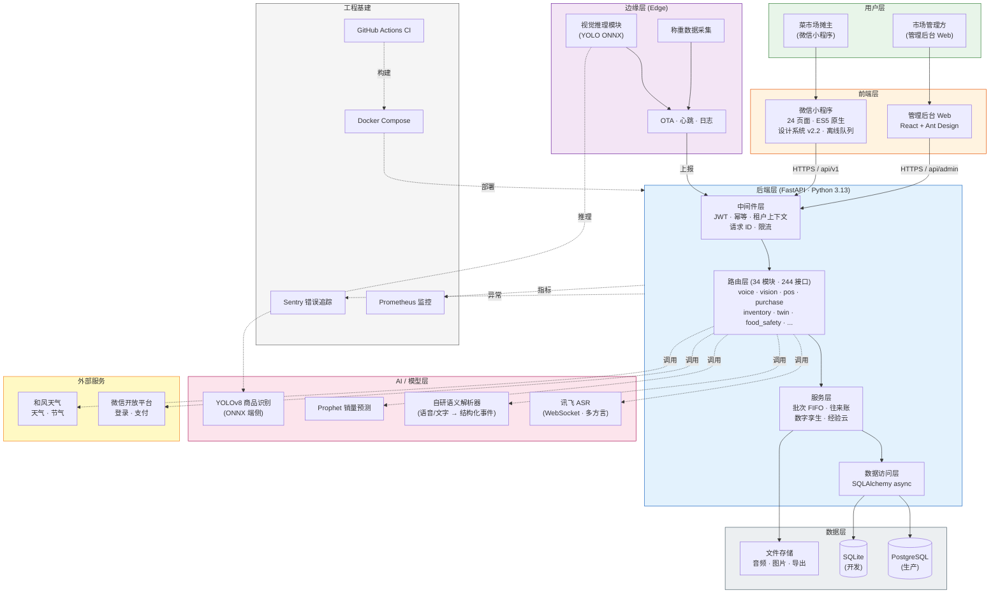
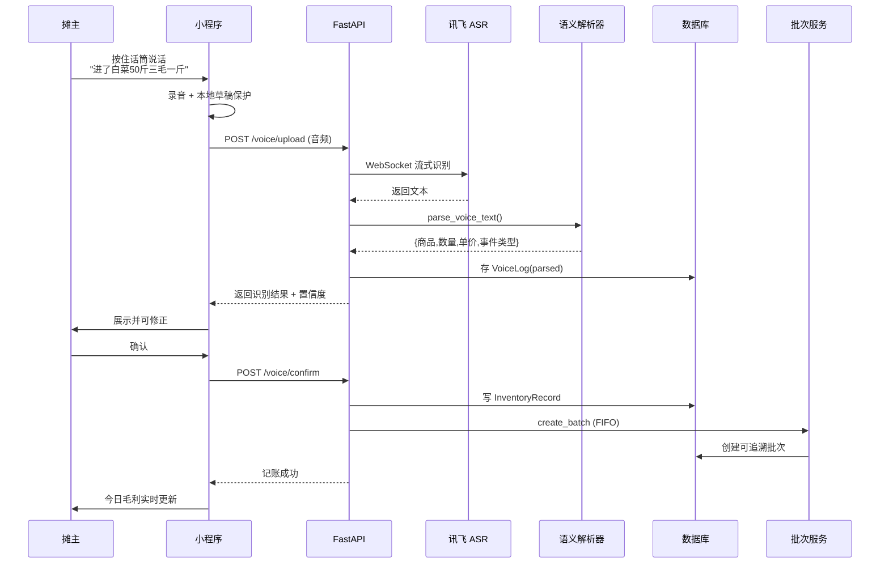
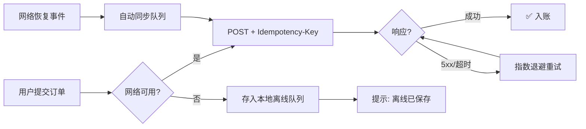
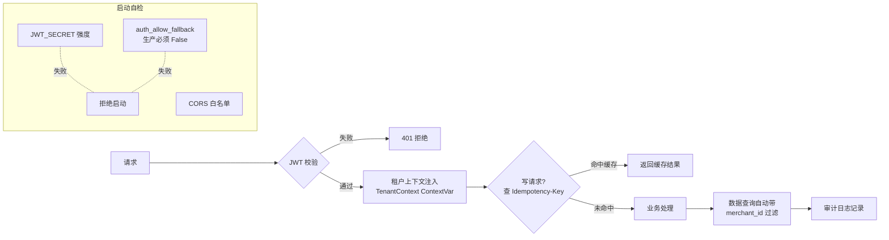

# 系统架构总览

> 千摊智脑——面向菜市场小微商户的 AI 多模态智能经营辅助系统。
>
> 本文档提供系统整体架构图与分层说明，供答辩演示、README、大创立项书共同引用。

---

## 一、总体架构图

---

## 二、核心数据流

### 2.1 语音记账全链路（核心卖点）

### 2.2 弱网容错流程（创新点 5）

---

## 三、分层职责说明

| 层 | 技术栈 | 核心职责 | 关键文件 |
|---|---|---|---|
| **前端·小程序** | 微信原生 ES5、自研设计系统 | 摊主交互、离线队列、Canvas 图表 | `miniprogram/` (24 页面) |
| **前端·管理后台** | React + Ant Design | 市场管理、SaaS 运营 | `backend/admin-web/` |
| **边缘层** | Python + ONNX Runtime | 端侧视觉推理、称重采集、OTA | `edge/` |
| **后端·中间件** | FastAPI Middleware | 鉴权、幂等、租户隔离、限流、审计 | `app/core/` |
| **后端·路由** | FastAPI APIRouter (34 模块) | 244 个 REST 接口，薄层 | `app/routers/` |
| **后端·服务** | Python | 批次 FIFO、往来账、数字孪生、经验云 | `app/services/` |
| **AI/ML** | 讯飞 ASR、YOLOv8、Prophet | 语音识别、视觉识别、销量预测 | `app/services/` + `ml/` |
| **数据层** | PostgreSQL / SQLite + Alembic | 持久化、迁移管理 | `app/database.py` + `migrations/` |
| **工程基建** | GitHub Actions、Docker、Prometheus、Sentry | CI/CD、容器化、监控、错误追踪 | `.github/` + `docker-compose*.yml` |

---

## 四、技术栈一览

| 分类 | 选型 | 选型理由 |
|---|---|---|
| 前端 | 微信小程序原生 | 摊主无需下载，微信内即开即用 |
| 后端框架 | FastAPI (async) | 高性能、自动文档、原生异步 |
| ORM | SQLAlchemy 2.0 (async) | 成稳可靠、支持异步 |
| 数据库 | PostgreSQL（生产）/ SQLite（开发） | 双后端兼顾生产严谨与开发便利 |
| 迁移 | Alembic | 唯一建表权威，版本可追溯 |
| 语音识别 | 讯飞 ASR v2 (WebSocket) | 支持方言、实时流式 |
| 视觉识别 | YOLOv8 (ONNX) | 端侧可部署、推理快 |
| 时序预测 | Prophet | 适合日级销量数据、可解释 |
| 监控 | Prometheus | 指标采集标准方案 |
| 错误追踪 | Sentry | 生产异常实时告警 |
| 容器化 | Docker Compose | 一键部署依赖完整 |

---

## 五、安全架构（重点）

**安全设计要点**：
1. 身份只来自 JWT token，绝不信任请求体中的 merchant_id
2. 生产环境启动自检（`validate_security`）fail-closed，致命误配直接拒绝启动
3. 多租户数据隔离通过 ContextVar + ORM 查询过滤双重保障
4. 写请求支持幂等键，客户端可安全重试
5. 关键操作（撤销、修改、退款）全链路审计日志

---

## 六、可扩展性设计

- **水平扩展**：后端无状态，可通过 Docker 副本横向扩展
- **租户扩展**：多租户架构天然支持商户增长
- **功能扩展**：模块化路由设计，新增业务域只需加 router + service
- **模型扩展**：AI 能力通过 service 层解耦，可替换 ASR/视觉/预测模型

---

> 📌 **使用指引**：
> - **答辩 PPT**：直接截图"总体架构图"+"语音记账全链路"
> - **README**：嵌入"总体架构图"作为核心视觉
> - **立项书**：引用"分层职责说明"表，呼应技术方案章节
