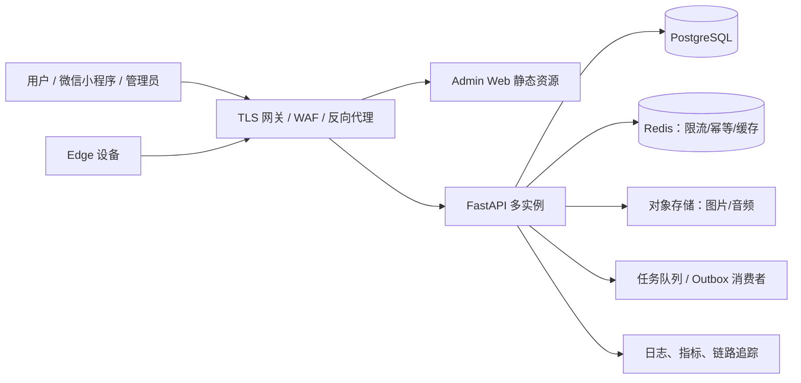

# 千摊智脑整套项目全面审计与整改复验报告

- **审计日期**：2026-07-13
- **整改复验日期**：2026-07-14
- **审计范围**：FastAPI 后端、SaaS 管理后台、微信小程序、数据库迁移、Docker/生产部署、Edge 设备、视觉与 ML 脚本、跨端 API 契约、权限与多租户隔离、幂等和基础安全
- **项目路径**：`E:\千摊\qiantan-brain`
- **审计方式**：静态结构分析、代码审阅、自动化测试、编译/构建、路由契约比对、空库迁移演练、类型与风格检查
- **变更说明**：已针对审计发现实施代码整改，并完成本地自动化复验；未清理、回滚或覆盖既有未提交修改

---

## 0. 整改复验结论（2026-07-14）

### 0.1 最新总体结论

**代码整改和本地自动化质量门禁已经完成，可以进入预发布环境；生产上线仍需完成环境级、真机和真实硬件验收。**

本轮已完成原审计报告中代码级 P0/P1 问题的整改和回归，包括数据库迁移漂移、Edge 设备认证与云端持久化、写请求幂等、租户高风险权限、管理员认证、小程序生产环境配置、后台模拟数据、前端包体、Docker 生产配置及工程质量问题。后端全量测试、静态检查、迁移演练、管理后台构建和小程序门禁均已通过。

当前结论边界如下：

1. **可以进入 staging/预发布**：代码、迁移和本地自动化检查已经达到预发布门槛。
2. **不能直接宣称生产验收完成**：当前机器没有 Docker CLI，尚未实际执行镜像构建、Compose 合并启动、Nginx 容器校验和服务健康检查。
3. **仍需真实端侧验收**：微信体验版/真机弱网、Edge 真实设备和模型长时间稳定性尚未在本轮环境中验证。
4. **仍需真实基础设施演练**：PostgreSQL、Redis、Nginx、TLS 证书、备份和恢复必须在预发布环境完成实操验收。

> 状态说明：本节是整改后的最新结论。第 1～17 节保留为整改前审计基线和问题证据，其中第 3～17 节描述的问题状态不再代表当前代码状态；发生冲突时以第 0 节为准。

### 0.2 最终自动化质量门禁

| 检查项 | 最终结果 | 状态 |
|---|---:|---|
| Ruff：`python -m ruff check app tests scripts ..\edge ..\ml` | **0 项** | 通过 |
| Mypy：`python -m mypy --explicit-package-bases app` | **0 errors / 127 source files** | 通过 |
| 后端 Pytest：`python -m pytest -q` | **358 passed** | 通过 |
| Python Compileall | `app/tests/scripts/edge/ml` 全部通过 | 通过 |
| Alembic fresh upgrade | 独立全新 SQLite 临时库升级到 head | 通过 |
| Alembic 漂移检查 | `No new upgrade operations detected.` | 通过 |
| 管理后台 ESLint | `npm run lint` | 通过 |
| 管理后台 Prettier | `npm run format:check` | 通过 |
| 管理后台生产构建 | `npm run build` | 通过 |
| 管理后台最大产物块 | **390.60 kB**，全部低于 500 kB | 通过 |
| 小程序 JS 语法 | **38 passed** | 通过 |
| 小程序结构健康检查 | **21 个页面，0 errors，0 warnings** | 通过 |
| 小程序离线同步 | **10 passed** | 通过 |
| 小程序环境配置行为 | **5 passed** | 通过 |
| 小程序 WXSS 禁用单位 | **0 个 `vh`/`vw`/`rem` 数值单位** | 通过 |
| Compose YAML 静态解析 | **3 个文件通过，服务数分别为 3/3/5** | 通过 |
| 备份/恢复 PowerShell AST | 两个脚本均通过 | 通过 |
| Docker CLI | **unavailable** | 环境限制，未实机验证 |

管理后台构建拆包后的主要产物如下：

```text
antd-runtime-vendor  390.60 kB / gzip 127.78 kB
index                 387.77 kB / gzip 114.69 kB
chart-vendor          328.72 kB / gzip  93.43 kB
react-vendor          160.38 kB / gzip  52.09 kB
```

整改前最大块为 866.66 kB；当前不存在超过 500 kB 的产物块，也不存在循环 chunk 告警。

### 0.3 已完成的核心整改

| 领域 | 已完成整改 | 复验结果 |
|---|---|---|
| 数据库迁移 | 补齐缺失表和幂等记录迁移，修复 ORM 元数据导入与迁移漂移 | fresh upgrade 和 `alembic check` 均通过 |
| Edge 安全 | 设备 API Key、scope、时间戳、nonce、停用状态和租户绑定校验；nonce 优先使用 Redis 原子 `SET NX EX`，并提供有界内存降级 | Edge auth/idempotency 定向测试通过 |
| Edge 数据闭环 | 新增设备 ingest 契约和云端事件持久化，补齐 UTC、图像摘要和模型版本 | 事件仅在服务端持久化成功后确认 |
| ML 模型供应链 | 模型 manifest、SHA256 完整性校验和 fail-closed 加载；锁定 Edge/ML 依赖版本 | 非法或缺失模型不再静默启动 |
| 全局幂等 | 写请求使用稳定 `Idempotency-Key`，后端增加幂等中间件和数据库记录 | 重试不会重复执行业务写入 |
| 管理员认证 | 默认使用 HttpOnly、SameSite=Strict Cookie；生产启用 Secure；JWT 30 分钟；Bearer token 响应需显式请求 | 浏览器不再把管理员 token 存入 localStorage |
| 权限与审计 | 租户暂停/恢复强制专用权限，状态机和审计写入保持事务一致 | 越权路径已封堵并有回归测试 |
| 小程序环境 | trial/release 忽略本地 storage 地址，强制 HTTPS，release 未配置时 fail-closed | 环境配置行为测试 5 项通过 |
| 小程序弱网 | 安全写重试、稳定幂等键和网络恢复同步保护 | 离线同步测试 10 项通过 |
| 管理后台 | 移除布局对 Pro Components 的依赖，保留暗色、折叠、菜单权限和路由状态；优化分包 | lint、format、build 全通过 |
| 数据安全 | CSV 公式注入防护、详细健康接口管理员鉴权、旧 Edge/供应商契约修复 | 纳入后端全量回归 |
| Docker/部署 | 数据服务默认不暴露宿主机端口、内部网络隔离、Redis `noeviction`、独立迁移服务、后端多实例、Nginx TLS/安全头/限流、非 root 镜像、备份恢复脚本 | 静态校验通过，仍待真实 Docker 环境验收 |

### 0.4 预发布环境必做验收

下列项目不是已知代码缺陷，但属于生产上线前必须完成的环境级验收：

1. 在具备 Docker CLI 的主机执行三份 Compose 文件的实际合并解析，构建全部镜像并启动完整服务。
2. 在目标 Nginx 镜像中执行 `nginx -t`，验证 HTTPS 证书、反向代理、安全头、CSP、HSTS 和限流规则。
3. 使用真实 PostgreSQL 和 Redis 执行迁移、并发幂等、故障恢复、连接池和 `noeviction` 行为验证。
4. 执行完整备份和恢复演练，确认恢复点、数据一致性、权限及操作时长满足 RPO/RTO 要求。
5. 使用微信体验版和至少两类真实设备验证登录、核心交易、弱网重试、断网恢复和正式 API 域名配置。
6. 使用真实 Edge 硬件执行设备注册、密钥轮换、断网续传、重复事件、时钟偏差、停用设备和跨租户攻击测试。
7. 使用生产候选模型做持续运行和资源压力测试，记录吞吐、延迟、内存、温度、准确率和回滚流程。
8. 预发布验收通过后再灰度上线，并为交易、库存、账务、设备 ingest 和管理员高风险操作配置监控告警。

### 0.5 发布判定

| 阶段 | 当前判定 | 说明 |
|---|---|---|
| 本地代码整改 | **完成** | P0/P1 代码级问题和工程门禁已处理 |
| 本地自动化复验 | **通过** | 以 0.2 节最终数据为准 |
| 预发布部署 | **可以开始** | 需在具备 Docker 和真实基础设施的环境执行 |
| 生产上线 | **待环境验收** | 0.4 节全部通过后再批准 |

---

## 1. 执行摘要（整改前审计基线）

### 1.1 整改前总体结论

> 本节为 2026-07-13 整改前结论，已由第 0 节的整改复验结论取代。

**整改前不建议直接进入生产上线。**

项目的主体架构已经形成，后端测试、Web 构建、小程序结构、跨端 API 路径契约等基础质量明显好于“原型阶段”；但数据库迁移、Edge 云端闭环、写请求幂等、租户高风险权限等方面仍存在上线阻断项。

建议按以下门槛推进：

1. 先修复本报告全部 P0；
2. 对 P1 中涉及生产环境、租户权限、管理员认证、数据持久化的项目完成整改；
3. 重新执行空库迁移、全量测试、Web 构建、小程序真机联调；
4. 通过预发布环境验收后再灰度上线；
5. 若 Edge/视觉能力不属于本期交付，必须通过功能开关、菜单隐藏和发布说明明确下线，不能以“已完成”状态对外开放。

### 1.2 整改前健康度概览

| 领域 | 结论 | 说明 |
|---|---|---|
| FastAPI 后端 | 基础健康，但有类型与迁移风险 | 333 个测试通过，225 条应用路由可加载；Mypy 仍有 80 个错误 |
| SaaS Web 管理后台 | 可构建，部分页面未闭环 | lint/build 通过；AiOps、设备和 Dashboard 部分数据仍为模拟数据 |
| 微信小程序 | 结构与契约健康，生产配置和幂等风险高 | 21 个页面完整，132/132 静态 API 方法与路径匹配；写请求默认重试 |
| 数据库迁移 | **阻断上线** | 单一 head、空库可升级，但缺少 `admin_audit_logs` 和 `merchant_feedback` 表迁移 |
| 权限与多租户 | 大部分健康，存在明确越权 | 后端 RBAC 基本完整；租户暂停可绕过专用权限 |
| Docker/部署 | 未形成完整生产闭环 | 缺 Web 静态服务、TLS/反代、上传持久卷、重启策略 |
| Edge/视觉 | **当前端到端不可用** | 无鉴权、服务端 ingest 不落库、视觉 detections 序列化错误 |
| ML 工程化 | 尚未生产就绪 | 模型需手工放置，依赖未锁定，缺模型/数据集版本与真机验收 |

---

## 2. 审计范围与方法

### 2.1 覆盖组件

- `backend/app`：FastAPI 应用、路由、服务、模型、安全和多租户基础设施
- `backend/tests`：后端测试集
- `backend/migrations`：Alembic 迁移链
- `backend/admin-web`：React/Vite/Ant Design SaaS 管理后台
- `miniprogram`：微信小程序页面、请求层和离线同步
- `edge`：称重/视觉 Edge 主循环、离线队列、云端上报
- `ml`：预测与训练脚本、模型依赖
- `docker-compose.yml`、Dockerfile 和部署文档
- 后端路由与小程序调用之间的方法、路径、响应信封契约

### 2.2 已执行检查

| 检查 | 结果 |
|---|---|
| `python -m pytest` | **333 passed**，约 29 秒 |
| `python -m compileall -q app tests scripts ..\edge ..\ml` | 通过 |
| FastAPI 应用导入 | 成功，应用共 **225 routes** |
| Ruff | 365 项，其中大部分是行长/格式问题，另有少量真实静态缺陷 |
| Mypy（`--explicit-package-bases app`） | **80 errors in 17 files** |
| 管理后台 `npm run lint` | 通过 |
| 管理后台 `npm run build` | 通过，4703 modules |
| 管理后台 `npm run format:check` | 失败，15 个文件未符合 Prettier |
| 小程序结构健康检查 | 通过，21 个页面四件套完整 |
| 小程序全部 JS `node --check` | 通过 |
| 小程序离线同步测试 | **10 passed** |
| 小程序 WXSS 规范检查 | 3 处单位不合规 |
| 小程序/后端 API 静态契约 | **132/132 方法和路径匹配** |
| Alembic heads | 单一 head：`h9c0d1e2f3a4` |
| Alembic 空库升级 | 成功，生成 56 张表 |
| `alembic check` | 失败，发现 ORM/迁移漂移 |
| Docker Compose 实际解析 | 未验证：审计环境没有 Docker CLI |

### 2.3 工具结论使用原则

- Ruff、Prettier、WXSS 单位等归为工程规范问题，不等同于业务故障。
- 小程序 `.workbuddy/code-audit.js` 报出 774 项，但大量是对 `wx:for` 的 `item/index` 和动态 `setData` 字段的误报，**不能当作 774 个真实 Bug**。
- Alembic 空库演练、缺表、RBAC 绕过、Edge 无鉴权/不落库等均有明确代码或运行证据，属于真实问题。

---

## 3. 上线阻断项（P0）

### P0-01：Alembic 缺少管理员审计日志表，fresh deployment 管理后台登录会失败

**状态：已验证真实问题。**

相关位置：

- `backend/app/models/admin_audit.py`
- `backend/app/core/audit.py`
- `backend/app/routers/admin/auth.py`
- `backend/migrations/versions/`

证据：

- 空库执行 `alembic upgrade head` 可以成功；
- 但升级后不存在 `admin_audit_logs`；
- `alembic check` 明确提出 `add_table admin_audit_logs`；
- 管理员登录成功后先提交 `last_login_at`，随后调用 `log_action()`；
- `log_action()` 会向 `admin_audit_logs` 写入并单独 `commit()`。

实际后果：

1. 管理员密码校验成功；
2. `last_login_at` 已提交；
3. JWT 已生成；
4. 写审计日志时数据库报表不存在；
5. 登录接口返回 500，fresh deployment 的 SaaS 管理后台无法正常登录。

整改要求：

- 新增正式 Alembic 迁移创建 `admin_audit_logs`；
- 为表、索引、字段约束编写迁移验证；
- 增加“空 PostgreSQL 数据库 upgrade + 管理员登录”集成测试；
- 不允许用生产 `create_all()` 掩盖迁移缺失。

验收标准：

- 空库升级后表存在；
- `alembic check` 无新增迁移操作；
- 管理员登录、登出和审计列表接口全部通过；
- 审计写入失败时事务语义明确，不出现业务已成功但响应 500 的不一致。

### P0-02：Edge 主链路没有鉴权，且服务端接收后不持久化

**状态：已验证真实问题。若本期承诺 Edge 功能，则阻断上线。**

相关位置：

- `edge/main.py`
- `backend/app/routers/edge.py`
- `edge/vision/api_client.py`

证据：

- `edge/main.py` 向 `/edge/ingest` POST 时没有 `Authorization`；
- 后端 `/edge/ingest` 依赖 `get_merchant_id`，生产关闭 auth fallback 后请求会返回 401；
- 后端 ingest 当前只验证、打日志并返回 accepted，没有写数据库；
- Edge 收到成功响应后会将本地记录更新为 `synced=1`。

实际后果：

- 正常生产安全配置下，Edge 数据无法同步；
- 即使补上 token，云端仍没有数据落库；
- Edge 可能将“云端未保存”的记录标记为已同步，造成数据静默丢失。

整改要求：

- 为每台设备设计设备身份、密钥轮换和租户绑定机制；
- ingest 必须持久化原始事件或标准化业务事件；
- 引入全局唯一 `event_id` 和数据库唯一约束；
- 服务端只在事务提交成功后返回 accepted；
- Edge 仅在收到明确 ACK 后标记同步；
- 增加超时重传、重复事件、断网恢复、token 过期、错误租户等集成测试。

如本期不交付 Edge：

- 关闭对应菜单和入口；
- 设置服务端 feature flag；
- 发布说明中明确“试验功能/暂未开放”；
- 不得让设备进入会丢数据的半可用状态。

### P0-03：小程序对所有 HTTP 方法默认自动重试，写请求缺少统一幂等保障

**状态：已验证高风险设计。对下单、库存、账务、付款等交易写操作应按 P0 处理。**

相关位置：

- `miniprogram/app.js:146-202`
- 后端 POS、采购、库存、账务等写接口

当前行为：

- 5xx、429 和网络异常默认最多重试 2 次；
- POST、PUT、DELETE 与 GET 使用同一默认策略；
- 未发现统一的 `Idempotency-Key` 中间件、幂等记录表或全局去重约束。

风险：

- 客户端请求已被服务端执行，但响应在网络中丢失；
- 客户端自动重试；
- 后端再次创建订单、扣减库存、记录收支或执行结算；
- 形成重复业务数据或资金/库存不一致。

整改要求：

- GET/HEAD 可默认指数退避重试；
- 写请求默认禁止自动重试；
- 确需重试的写请求必须显式 `retrySafe: true` 并携带幂等键；
- 后端建立统一幂等组件：租户 + 操作 + 幂等键唯一约束、请求摘要校验、结果缓存、处理中冲突处理、TTL 清理；
- 对支付、订单、库存、采购、盘点和账务分别补充重复请求测试。

---

## 4. 高优先级问题（P1）

### P1-01：租户暂停权限可绕过专用 `TENANT_SUSPEND` 权限

**状态：已验证真实越权。**

相关位置：`backend/app/routers/admin/tenants.py`

`update_tenant` 仅依赖 `TENANT_UPDATE`。当请求把租户状态修改为 `suspended` 时，代码没有实际校验 `TENANT_SUSPEND`。因此拥有租户编辑权限、但没有暂停权限的 `ops_admin` 仍可通过通用更新接口暂停租户。

整改：

- 状态进入或离开 `suspended` 时强制校验 `TENANT_SUSPEND`；
- 更推荐拆分 `/suspend`、`/resume` 专用高风险接口；
- 记录原因、操作者、原状态、新状态；
- 增加角色矩阵回归测试，覆盖前端隐藏与后端强制拒绝。

### P1-02：`merchant_feedback` 模型没有对应迁移

**状态：已验证真实问题。**

- `alembic check` 提出 `add_table merchant_feedback`；
- 空库升级后该表不存在；
- `POST /api/v1/feedback` 在 fresh DB 上提交时会报 500。

整改：新增迁移并补充反馈创建/查询集成测试。

### P1-03：Alembic autogenerate 元数据导入不完整

**状态：已验证工程缺陷。**

`app/models/__init__.py` 未完整导入实际 ORM 模型文件，例如：

- `device.py`
- `expense.py`
- `market.py`
- `media.py`
- `payment.py`
- `staff.py`

这使 `alembic check` 同时误判部分已迁移表应被删除，迁移漂移检查不可信。

整改：

1. 补全模型导入和 `__all__`；
2. 确保 Alembic `target_metadata` 加载全部模型；
3. 重新生成并人工审阅迁移；
4. CI 中增加空库升级和 `alembic check` 门禁。

### P1-04：小程序生产 API 默认指向 localhost

相关位置：`miniprogram/app.js`

默认值：

```js
apiBase: 'http://127.0.0.1:8001/api/v1'
```

虽然可以通过 storage 覆盖，但正式版真机不能依赖人工本地存储配置。

整改：

- dev/test/staging/prod 构建配置分离；
- 生产只允许 HTTPS 合法域名；
- 发布构建阶段拒绝 localhost、明文 HTTP 和未备案域名；
- 微信公众平台 request/uploadFile 合法域名与服务端 CORS/网关配置同步维护。

### P1-05：管理员 JWT 存储在 localStorage，且默认有效期长达 7 天

相关位置：

- `backend/admin-web/src/api/client.js`
- `backend/admin-web/src/context/AuthContext.jsx`
- 后端 JWT 配置

风险：任何管理端 XSS 都可直接读取长期管理员 Bearer Token。

整改优先方案：

- HttpOnly + Secure + SameSite Cookie；
- 短时 access token + refresh token 轮换；
- 管理员会话独立时效，建议显著短于商户会话；
- 高风险操作二次验证；
- CSP、依赖安全检查和登录设备/会话管理。

### P1-06：容器未持久化上传目录

Compose 没有给 backend 挂载 `uploads`、`uploads/audio` 等持久卷。容器替换、重建或调度迁移后，上传文件可能丢失。

整改：生产改为对象存储，或至少挂载明确的持久卷并建立备份、生命周期和访问控制。

### P1-07：管理后台部分核心页面仍使用模拟数据

已确认：

- `src/pages/AiOps.jsx`：AI Action 模拟数据；
- `src/pages/Dashboard.jsx`：最近动态和待办模拟数据；
- `src/pages/Devices.jsx`：设备模拟数据。

风险：页面看似完整，但无法形成真实业务闭环，容易造成验收误判。

整改：

- 页面增加明确的 `mock/dev` 标识或 feature flag；
- 生产构建禁止模拟数据；
- 补齐真实 API、空状态、错误状态、权限状态和加载状态；
- 以端到端验收脚本确认数据确实来自后端。

### P1-08：Edge/ML 依赖和模型发布不可复现

项目没有独立锁定：

- Edge runtime 依赖；
- ML training 依赖；
- ML evaluation 依赖。

代码涉及 `Pillow`、`numpy`、OpenCV、ONNX Runtime、Picamera2、GPIO、Pandas、Prophet、Ultralytics 等，现有后端依赖不能复现 Edge/ML 环境。

整改：

- 拆分并锁定依赖；
- 记录 Python、ARM/系统库和硬件兼容矩阵；
- 模型文件必须有版本、SHA256、类别映射和输入输出契约；
- 训练数据集记录版本和授权来源；
- 建立真机冒烟、离线运行和模型回滚方案。

---

## 5. 中优先级问题（P2）

### P2-01：Tenant ContextVar 清理缺少 `try/finally`

`TenantContextMiddleware` 在正常请求结束时清理上下文，但 `call_next()` 抛异常时末尾 clear 可能不执行。

ASGI 通常为每个请求创建独立 Task，因此不能直接断言已经发生跨租户泄漏；但这是需要修复的防御性隔离缺陷。

建议使用 ContextVar token：

```python
token = _tenant_id_var.set(None)
try:
    return await call_next(request)
finally:
    _tenant_id_var.reset(token)
```

并增加并发请求、异常请求、后台任务和 WebSocket 场景测试。

### P2-02：CSV 导出没有防公式注入

`backend/app/core/export.py` 直接把 `rows` 传给 `csv.DictWriter.writerows()`，没有处理以 `=`, `+`, `-`, `@` 开头的单元格。

若租户名称、邮箱、备注等可控字段进入导出文件，管理员用 Excel/WPS 打开时可能触发公式解释。

整改：

- 对可控字符串增加 CSV 公式转义；
- 建议在危险前缀前加单引号，并保留原始数据说明；
- 加入包含 `=HYPERLINK(...)`、`+cmd...`、`@SUM(...)` 等测试样例。

### P2-03：详细健康接口未鉴权，公开内部运行状态

`GET /api/v1/health/detailed` 没有认证依赖，会返回：

- 数据库连接是否正常；
- 心跳超时设备数量；
- 当前健康状态、问题描述和时间戳。

当前没有直接暴露数据库地址、密钥或设备明细，因此不是高危泄密；但它给外部攻击者提供了内部故障和设备运行情报。

整改：

- 对外仅保留最小 `/health` 或网关级存活探针；
- detailed/readiness 指标仅允许内网、监控身份或管理员权限访问；
- 区分 liveness、readiness 和 operator diagnostics。

### P2-04：审计日志与业务操作使用独立 commit，事务一致性不清晰

`log_action()` 内部固定 `await db.commit()`。部分管理接口会先提交业务数据，再写审计日志。

风险：

- 业务数据已经生效；
- 审计写入失败；
- 接口返回 500；
- 客户端可能重试，造成重复操作或状态误判。

管理员登录缺表问题已经实际暴露了该事务设计风险。

建议：

- 明确“业务与审计同事务”或“审计异步可靠投递”的架构；
- 同事务方案由调用方统一 commit，`log_action()` 只 add/flush；
- 异步方案使用 outbox，业务事务写入审计事件，消费者再落审计表；
- 禁止“业务已提交后因非核心日志失败而整体返回 500”。

### P2-05：登录限流只存在于单进程内存

当前限流按客户端 IP + 邮箱记录在进程内字典中：

- 多 worker/多实例不共享；
- 进程重启后清空；
- 反向代理真实 IP 配置错误时，所有用户可能共享代理 IP。

整改：Redis/集中式限流，分别设置 IP、账号、设备指纹和全局阈值，并正确配置 trusted proxy。

### P2-06：管理端首屏依赖包仍偏大

构建结果：

- app：63.54 kB，gzip 25.49 kB；
- react-vendor：161.06 kB，gzip 52.63 kB；
- chart-vendor：334.74 kB，gzip 98.89 kB；
- antd-vendor：1,243.15 kB，gzip 393.01 kB。

路由懒加载和 manualChunks 已经改善主包，这是健康项；但把 `chunkSizeWarningLimit` 调到 1300 只会压掉告警，不会改善真实性能。

整改：按页面引入图表和重组件、检查 Ant Design 引入方式、分析 bundle、延迟加载低频模块。

### P2-07：Mypy 仍有 80 个类型错误

主要类别：

- `services/behavior.py` 使用 `MerchantPreference` 不存在字段；
- POS、库存、operations 多处可空值未保护；
- tenant portal 中 `UUID | None` 传递不严谨；
- `admin/tenants.py` 使用未导入的 `PlatformAdmin`；
- `admin/invoices.py` 类型不匹配；
- `auth.py` 可能把 None 传给 token 吊销；
- `inventory.py` 混用 float 与 Decimal。

普通 Mypy 运行还存在 `models.saas` 与 `app.models.saas` 被识别为重复模块的问题，应先统一包入口和检查配置。

建议将错误按“真实运行风险、模型契约、可空值、数值精度、纯注解”分批清零，并把 Mypy 纳入 CI 的增量门禁。

### P2-08：Docker 生产部署链路不完整

`docker-compose.yml` 当前主要包含 PostgreSQL 和 FastAPI backend，未包含：

- admin-web 构建与静态服务；
- Nginx/Caddy/Ingress；
- TLS 终止；
- 完整生产域名和 CORS 示例；
- restart policy；
- 统一日志、指标和告警；
- 上传持久化；
- 数据库备份/恢复任务。

PostgreSQL 直接映射宿主 `5432:5432`，生产环境通常不应默认公开。后端直接暴露 8000，也没有 TLS 层。

本轮未执行 `docker compose config`，原因是审计环境没有 Docker CLI；这属于**未验证项**，不表示 Compose 语法失败。

### P2-09：Edge 队列只标记 synced，不做归档或清理

长期运行后本地 SQLite 会持续增长。应增加保留期、批量归档、容量水位告警、VACUUM 策略和磁盘满保护。

### P2-10：视觉 APIClient 认证和序列化不符合后端契约

`edge/vision/api_client.py`：

- 没有 Authorization；
- 只提交 `merchant_id` form 字段，但后端身份来自 token；
- `detections` 使用 `str(detections)`，后端用 `json.loads()`；Python repr 的单引号通常不是合法 JSON。

应改为标准 JSON 序列化，例如 `json.dumps(detections, ensure_ascii=False)`，并与设备身份、租户和上传幂等键一起设计。

---

## 6. 低优先级与工程规范问题（P3）

### 6.1 Ruff

共 365 项：

| 规则 | 数量 | 说明 |
|---|---:|---|
| E501 | 236 | 行过长 |
| E701 | 48 | 单行复合语句 |
| I001 | 28 | import 排序 |
| F401 | 19 | 未使用导入 |
| E702 | 15 | 分号语句 |
| F541 | 7 | 无占位符 f-string |
| E712 | 4 | 布尔比较风格 |
| B904 | 2 | 异常链 |
| E741 | 2 | 歧义变量名 |
| F821 | 2 | 未定义名称 |
| F811 | 1 | 重复定义/导入 |
| F841 | 1 | 未使用变量 |

其中应优先处理的真实静态缺陷：

- `backend/app/routers/admin/tenants.py:213,338`：`PlatformAdmin` 未导入；
- `backend/app/routers/auth.py:38`：`AnyResponse` 重复导入；
- `backend/app/routers/admin/invoices.py:262`：变量赋值后未使用。

应用目前仍能导入，不代表这些分支运行时安全。

### 6.2 Web 格式

`npm run format:check` 有 15 个文件不符合 Prettier。lint/build 均通过，因此属于规范门禁问题。

### 6.3 小程序样式单位

`miniprogram/pages/supplier/supplier.wxss` 第 181、186、191 行使用 `vh/vw/rem`，不符合项目要求的 `rpx/px/%` 规范。

### 6.4 小程序重复方法

`miniprogram/app.js` 中 `getCity` 在约第 273 和 287 行重复定义，后一个会覆盖前一个。应删除重复实现并补充调用测试。

---

## 7. 后端专项结论

### 7.1 健康项

- 333 个测试全部通过；
- Python 全量编译通过；
- FastAPI 应用可以正常导入，225 条路由完成注册；
- 管理员 JWT 与商户 JWT issuer 已分离；
- 管理员 token 有吊销机制；
- 生产安全自检会阻止弱 `JWT_SECRET` 和 auth fallback；
- CORS 为 `*` 时关闭 credentials，避免通配符与凭证组合；
- 平台管理路由大部分具有后端 RBAC，不只是前端隐藏；
- tenant portal 会拒绝缺少 tenant_id 的商户，并对发票、订阅等查询添加 tenant_id 条件。

### 7.2 需重点处理

- 迁移与 ORM 漂移；
- 管理员高风险权限边界；
- 类型错误中的可空值和 Decimal 精度问题；
- 审计日志事务策略；
- 分布式登录限流；
- detailed health 的访问控制；
- CSV 导出安全；
- 写接口的统一幂等组件。

---

## 8. SaaS 管理后台专项结论

### 8.1 健康项

- ESLint 通过；
- Vite 生产构建通过；
- 路由懒加载和 vendor 拆分已实施；
- 前端权限展示与后端权限接口已经形成基本框架。

### 8.2 未完成闭环

- AiOps、Devices、Dashboard 部分数据仍是模拟数据；
- 管理员 token 长期保存在 localStorage；
- 缺少完整的生产静态服务和 TLS/反代部署；
- 缺少对 401、403、429、5xx、网络离线和权限变更的统一体验规范；
- 需要加入生产构建“禁止 mock 数据”检查。

---

## 9. 微信小程序专项结论

### 9.1 健康项

- 21 个页面四件套完整；
- JSON 配置正常；
- TabBar 图标存在；
- 全部 JS 语法检查通过；
- 离线同步测试 10 个通过；
- 132 个静态 API 调用的方法和路径全部与后端匹配；
- 唯一动态导出调用也人工确认对应后端 `/ops/export/sales`、`/waste`、`/inventory` 路由。

### 9.2 核心风险

- 生产 API 地址没有构建期环境隔离；
- 写请求默认自动重试；
- 当前成功响应只认 `body.code === 0`，目前已调用端点都具有 `code`，暂未发现实际响应信封不匹配；
- 重试、离线队列和后端幂等尚未形成统一协议；
- 需要真机验证合法域名、上传、弱网、token 过期、重复点击和断网恢复。

---

## 10. 跨端 API 契约结论

本轮通过运行时 FastAPI 路由和小程序 JS 调用提取进行比对：

```text
backend /api/v1 routes: 181
miniprogram extracted calls: 132
unmatched static calls: 0
dynamic calls: 1
```

动态调用位于 `miniprogram/pages/ops/ops.js`，实际生成：

- `/ops/export/sales`
- `/ops/export/waste`
- `/ops/export/inventory`

后端均存在对应 GET 路由。

**结论：当前小程序到后端的方法+路径契约是健康项。**

后续建议把该比对脚本固化到 CI，并进一步扩展：

- 请求体字段；
- query/path 参数；
- 响应模型与 `code/data/message` 信封；
- 枚举值；
- 权限要求；
- 幂等要求；
- 文件上传 content-type 和大小限制。

---

## 11. 数据库与迁移专项结论

### 11.1 健康项

- Alembic 只有一个 head：`h9c0d1e2f3a4`；
- 迁移链连续；
- SQLite 临时空库可以升级到 head；
- 升级后生成 56 张表；
- tenants、plans、subscriptions、saas_invoices、usage_records、api_keys、platform_admins 等 SaaS 表存在。

### 11.2 阻断问题

- `admin_audit_logs` 缺失；
- `merchant_feedback` 缺失；
- models import 不完整导致 autogenerate 元数据失真；
- `database.py:init_db()` 在迁移成功后直接返回，不会用 `create_all()` 补缺表，因此生产不会自动修复。

### 11.3 必须加入 CI 的迁移门禁

1. 启动临时 PostgreSQL；
2. 从空库执行 `alembic upgrade head`；
3. 执行 `alembic check`；
4. 启动 FastAPI；
5. 执行管理员登录、反馈创建和核心交易冒烟；
6. 对现有版本执行增量升级；
7. 验证 downgrade 策略或明确不可逆迁移流程；
8. 验证索引、唯一约束、外键和 tenant_id 过滤。

SQLite 演练不能替代最终 PostgreSQL 验证。

---

## 12. Docker 与生产部署专项结论

当前 Compose 更接近开发/联调环境，不是完整生产拓扑。

建议生产拓扑：



最低生产要求：

- TLS、域名、HSTS 和可信代理配置；
- admin-web 静态服务；
- backend 多实例和健康探针；
- 数据库不公开公网端口；
- 上传进入对象存储；
- 数据库备份、恢复演练和迁移回滚预案；
- 集中日志、请求 ID、错误告警；
- secret 不写进镜像和仓库；
- 容器 restart policy、资源限制和只读文件系统评估。

---

## 13. Edge 与 ML 专项结论

### 13.1 当前成熟度判断

项目文档已经说明 YOLO 权重需要手工放置、真机仍待验证，Edge 属于建设中状态。结合本轮代码审计，不能认定视觉和称重同步已具备生产条件。

### 13.2 必须建立的端到端协议

每条 Edge 事件至少应包含：

```json
{
  "event_id": "设备生成的全局唯一 ID",
  "device_id": "设备 ID",
  "tenant_id": "由设备凭证绑定，不信任客户端任意传入",
  "event_type": "weight|vision|heartbeat",
  "occurred_at": "设备事件时间",
  "sequence": 12345,
  "payload_version": 1,
  "payload": {},
  "model_version": "可选",
  "checksum": "可选"
}
```

服务端要求：

- 验证设备身份和租户绑定；
- `event_id` 唯一；
- 同一幂等键、不同请求摘要必须返回冲突；
- 原始事件与业务派生数据可追溯；
- ACK 只在持久化成功后返回；
- 记录重放、延迟、失败、积压和设备最后在线时间。

### 13.3 ML 发布要求

- 模型注册表：名称、版本、SHA256、输入尺寸、类别列表、阈值；
- 数据集版本和训练参数；
- 评估指标及分品类混淆矩阵；
- 灰度部署和快速回滚；
- 模型不存在、损坏、类别不匹配时 fail-safe；
- 真机温度、延迟、内存、帧率和断网测试。

---

## 14. 分阶段整改计划

### 14.1 48 小时：阻断项止血

1. 新增 `admin_audit_logs`、`merchant_feedback` 迁移；
2. 补齐 Alembic 模型导入；
3. 空 PostgreSQL 迁移和关键接口冒烟；
4. 修复租户暂停权限绕过；
5. 小程序写请求默认不重试；
6. 生产构建拒绝 localhost API；
7. Edge 功能二选一：完成最小鉴权+落库，或通过 feature flag 完整下线；
8. 管理后台标识/移除生产模拟数据。

### 14.2 1 周：形成预发布闭环

1. 建立统一幂等组件并覆盖核心写接口；
2. 管理员短会话与安全 token 存储；
3. 上传对象存储/持久卷；
4. detailed health 访问控制；
5. CSV 公式转义；
6. Redis 登录限流；
7. 修复高风险 Mypy 错误；
8. CI 加入测试、编译、lint、build、契约和迁移门禁；
9. 预发布环境完成微信真机和 Web E2E。

### 14.3 2–4 周：生产工程化

1. 完整 TLS/网关/静态服务/多实例部署；
2. 指标、日志、告警和审计可靠性；
3. Edge 设备身份、事件幂等、云端持久化和断网恢复；
4. ML 依赖锁定、模型注册和真机基准；
5. 完成 AiOps、Devices、Dashboard 真实数据闭环；
6. 清理 Ruff/Mypy/Prettier/WXSS 规范债务；
7. 完成备份恢复、灾难恢复和回滚演练。

---

## 15. 上线验收清单

### 数据库

- [ ] 空 PostgreSQL `alembic upgrade head` 成功
- [ ] `alembic check` 无漂移
- [ ] `admin_audit_logs`、`merchant_feedback` 存在
- [ ] 管理员登录和反馈提交通过
- [ ] 生产备份和恢复演练通过

### 后端

- [ ] 全量测试通过
- [ ] 应用启动安全自检通过
- [ ] P0/P1 类型问题已修复
- [ ] RBAC 角色矩阵测试通过
- [ ] 多租户并发与异常隔离测试通过
- [ ] 写操作幂等测试通过
- [ ] detailed health 不对公网泄露内部状态
- [ ] CSV 导出公式注入测试通过

### 管理后台

- [ ] lint/build/format 全部通过
- [ ] 生产无 mock 数据
- [ ] 管理员 token 不长期暴露于 localStorage
- [ ] 401/403/429/5xx 统一处理
- [ ] 高风险操作二次确认和审计
- [ ] HTTPS 静态部署可用

### 小程序

- [ ] 生产包 API 为 HTTPS 正式域名
- [ ] 合法域名配置完成
- [ ] 写请求不会无条件自动重试
- [ ] 幂等键协议与后端一致
- [ ] 真机上传、弱网、断网恢复和 token 过期通过
- [ ] 页面无开发/模拟数据

### Edge/ML

- [ ] 设备身份和租户绑定通过
- [ ] ingest 真实落库
- [ ] 重复 event_id 不重复处理
- [ ] ACK 丢失重传不丢不重
- [ ] 队列清理和磁盘满保护
- [ ] 模型版本、SHA256 和类别映射可追溯
- [ ] 真机性能与长稳测试通过

### 部署与运维

- [ ] TLS/反代/WAF 配置完成
- [ ] 数据库端口不对公网开放
- [ ] 上传持久化或对象存储完成
- [ ] restart policy、资源限制和健康探针完成
- [ ] 日志、指标、告警和请求 ID 可用
- [ ] 发布、迁移、回滚手册经过演练

---

## 16. 建议的整改执行提示词

以下提示词可直接用于后续 Codex 任务，建议一次只执行一个主题，避免在当前大量未提交修改上产生冲突。

### 提示词 A：修复数据库迁移阻断项

```text
请只处理数据库迁移一致性，不改业务行为。
1. 检查 app/models 下所有 SQLAlchemy 模型并补齐 Alembic target_metadata 的导入。
2. 新增迁移创建 admin_audit_logs 和 merchant_feedback，字段、索引、约束必须与 ORM 一致。
3. 不修改或重写已有迁移，不使用 create_all 掩盖问题。
4. 在临时 PostgreSQL 空库执行 alembic upgrade head 和 alembic check。
5. 增加管理员登录、审计写入、反馈创建的集成测试。
6. 输出改动文件、迁移风险、验证命令和结果；不要提交 git，除非我明确要求。
```

### 提示词 B：修复租户暂停 RBAC 绕过

```text
请审计并修复 SaaS 管理后台租户状态变更权限。
重点检查 backend/app/routers/admin/tenants.py：拥有 TENANT_UPDATE 但没有 TENANT_SUSPEND 的角色不得把租户进入或移出 suspended。
优先将 suspend/resume 拆成独立端点；若保持通用 update，则对状态跃迁做后端权限强校验。
补充角色矩阵测试、审计日志、状态转换合法性和 403 响应测试。
不要只改前端隐藏；必须以后端拒绝为准。
```

### 提示词 C：建立写请求幂等与安全重试

```text
请为微信小程序和 FastAPI 后端设计并实现统一写请求幂等机制。
要求：
- GET/HEAD 可默认重试；POST/PUT/PATCH/DELETE 默认不重试。
- 允许重试的写请求必须显式 retrySafe 并携带 Idempotency-Key。
- 后端按 tenant_id + operation + idempotency_key 建唯一约束，保存请求摘要、状态码和响应。
- 相同 key 相同请求返回首次结果；相同 key 不同请求返回 409；处理中请求有明确响应。
- 覆盖下单、库存、采购、付款、账务和盘点。
- 增加响应丢失、并发重复、超时重试和跨租户相同 key 测试。
先给出设计和迁移方案，再小步实现；不要批量重构无关模块。
```

### 提示词 D：完成或安全下线 Edge 链路

```text
请先判断本期是否交付 Edge；如果交付，完成最小生产闭环：
1. 设备身份、token/签名、设备与 tenant 绑定；
2. edge/main.py 和 vision APIClient 携带认证；
3. 每条事件生成全局唯一 event_id；
4. /edge/ingest 持久化后才 ACK；
5. 数据库唯一约束去重；
6. Edge 仅收到持久化成功 ACK 后标记 synced；
7. detections 使用标准 JSON；
8. 增加断网、ACK 丢失、重复上报、过期 token、错误租户测试。
如果本期不交付，则实现 feature flag、关闭菜单/接口并在文档明确，不保留半可用入口。
```

### 提示词 E：生产部署闭环

```text
请基于当前 docker-compose.yml 设计 staging/prod 部署方案，不覆盖开发配置。
需要包含 admin-web 静态构建、TLS 反向代理、FastAPI 多实例、PostgreSQL 私网、Redis、对象存储、持久卷、健康探针、restart policy、日志指标、secret 管理、数据库备份恢复和迁移 job。
先输出拓扑、环境变量清单、端口暴露表和上线/回滚步骤，再创建部署文件。
所有生产默认值必须 fail-closed，禁止 localhost、弱 JWT_SECRET、auth fallback 和数据库公网暴露。
```

---

## 17. 最终判断

### 可以肯定的优点

- 自动化测试基础扎实；
- FastAPI、小程序和 Web 主体均可编译/构建；
- 小程序到后端的路径契约目前完整；
- 平台 RBAC 和多租户框架已具雏形；
- 安全自检、JWT issuer 分离、CORS 处理、路由懒加载等方向正确。

### 不能忽略的现实

- fresh deployment 的 SaaS 管理登录会被缺迁移阻断；
- Edge 当前既无法在生产鉴权下上报，也没有真正云端落库；
- 交易型写请求的自动重试没有统一幂等保护；
- 租户暂停存在明确的后端权限绕过；
- 生产部署、文件持久化、Web 静态服务和 TLS 尚未形成完整闭环。

**最终建议：不直接上线。修复 P0 后进入预发布，完成关键 P1 和真实环境验收后再灰度。**
