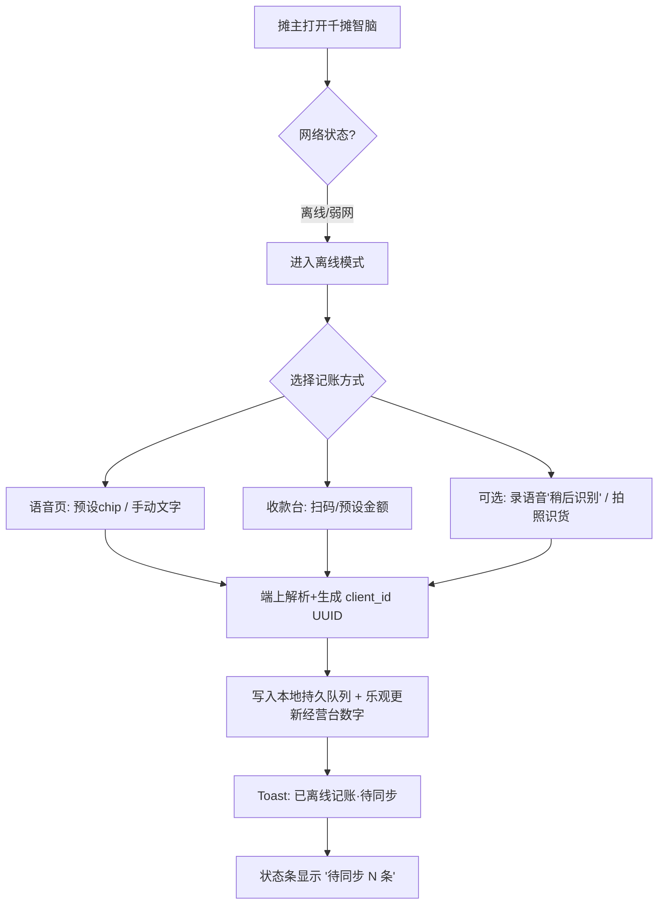
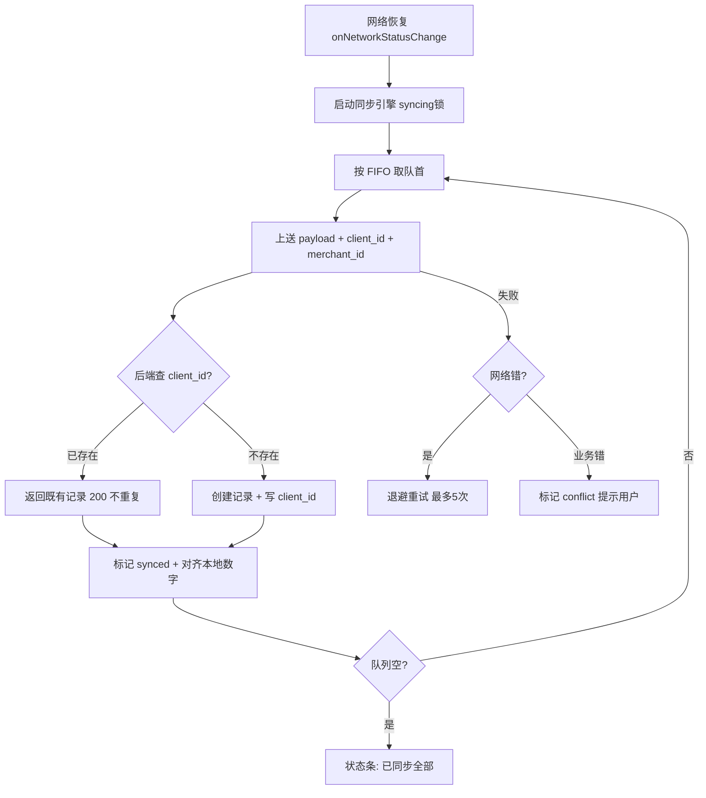

# 千摊智脑 · 离线记账与断网同步 — 产品规格文档（PRD）

> **文档状态**：Draft v0.2（评审补充：批量新增 9 项需求 R1–R9）
> **负责人（PM）**：产品通
> **创建日期**：2026-07-11
> **关联产品**：千摊智脑（微信小程序 + 后端 + 树莓派边缘端）
> **评审对象**：研发 Leader、测试、UI 设计（像素君）、摊主运营

---

## 0. 文档信息速览

| 项 | 内容 |
|---|---|
| 一句话定位 | 让摊主在**断网/弱网**场景下也能即时记账，联网后**无感、无重复、不丢账**地自动同步 |
| 核心价值 | 把"信号差→丢生意→记不上账"的体验断点补上，记账数据零丢失 |
| 北极星指标 | 离线记账留存率 ≥ **99.5%**（成功同步数 / 用户发起的离线记账数） |
| MVP 范围 | 语音记账（离线快捷/手动录入）+ 收款台收款 离线可用、联网自动同步 |
| 关键约束 | 讯飞 ASR 必须联网；收款台后端接口为前置依赖 |

---

## 1. 功能概述与目标

### 1.1 背景与问题陈述

摊主（菜市场、夜市、早市）的经营场所普遍存在**信号差、网络抖动、高峰期拥塞**的问题。当前"千摊智脑"的所有记账动作（语音记账、视觉识货、收款台、采购确认、库存盘点）都依赖实时联网：

- 断网时 `request()` 直接报错，摊主**记不上这笔账**；
- 高峰期排队顾客多，摊主被迫"先收钱、凭脑子记"，事后极易漏记、错记；
- 一天结束盘账发现金额对不上，损耗/毛利数据失真，反过来影响 AI 参谋与经营报告的准确性。

**代价**：记账丢失 → 经营数据失真 → AI 建议失准 → 摊主对产品信任下降 → 留存受损。这是"数据准确性"这条产品生命线的地基问题，不是锦上添花。

> 注：当前 `miniprogram/app.js` 已有 `checkApiHealth()` 与网络状态监听基础能力，本功能是在其之上的**持久化队列 + 幂等同步**补全，而非从零搭建。

### 1.2 目标（Goals）

**用户目标（摊主得到什么）**
- G1：断网时照样能记账，且**立刻**看到这笔账计入今日经营数字（乐观更新）。
- G2：重新联网后**不用手动操作**，离线记账自动、安静地同步上去。
- G3：绝不会因为离线/同步出现**一笔账记两次**或**记丢**。

**业务目标（产品/公司得到什么）**
- G4：离线记账留存率 ≥ 99.5%（北极星），从根上消除"断网丢账"类客服工单。
- G5：断网场景下的日活留存不劣于联网场景（验证离线能力对留存的托底作用）。
- G6：为后续边缘端（树莓派）离线闭环、实地 3–5 家商户实测扫清数据一致性障碍。

### 1.3 成功指标（北极星 + 驱动 + 健康）

| 类型 | 指标 | 基线/假设 | 目标值 | 观测方式 |
|---|---|---|---|---|
| 北极星 | 离线记账留存率 = 成功同步数 / 发起数 | 无历史（新功能） | ≥ 99.5% | 后端 `client_id` 去重 + 队列日志 |
| 驱动 | 联网→全队列同步完成 中位延迟 | — | ≤ 5s（≤20 条） | 队列 `created_at` vs `synced_at` |
| 驱动 | 离线记账占总记账比例 | 假设 15–25%（摊主场景） | 观测项 | 离线标记 vs 总记录 |
| 驱动 | 同步失败率 | — | < 0.5% | 失败状态条目 / 总量 |
| 驱动 | 冲突发生率 | — | < 1% | 冲突标记条目 |
| 健康 | 本地队列积压 > 50 条 的会话占比 | — | < 2% | 队列长度分布 |
| 健康 | 同步期间小程序崩溃率 | — | < 0.1% | 微信后台崩溃上报 |
| 滞后 | 断网场景日活留存（vs 联网） | — | 不劣化 |  cohort 留存对比 |
| 驱动 | 冲突处理完成率 = 已处理冲突 / 总冲突 | — | ≥ 90% | 冲突中心操作日志 |
| 驱动 | 离线确认反馈触达率（语音/震动触发成功） | — | ≥ 99% | 端上反馈触发埋点 |
| 健康 | 存储预警命中率（预警后用户及时同步比例） | — | 观测项 | 预警事件 vs 后续同步 |

> 基线与目标值均为**假设**，上线后 1 周/1 月各评估一次（见 §8）。

---

## 2. 目标用户群体

| 用户类型 | 画像 | 离线场景 | 核心诉求 |
|---|---|---|---|
| 主操作用户：摊主本人 | 菜市场/夜市个体户，40–60 岁居多，手机中端，对 App 流畅度敏感 | 早市/晚市高峰、地下/铁皮棚信号死角 | 快、稳、不丢账、看得到数字 |
| 兼职帮手：家属/雇工 | 临时顶班，不熟悉复杂操作 | 摊主不在时的断网时段 | 一键记账、别出错 |
| 间接用户：后端/AI | 经营报告、AI 参谋、数字孪生 | — | 拿到完整、准确的全量数据 |

**覆盖规模假设**：全部活跃摊主均为潜在受益者（断网与每个人都有概率相遇），无需画像筛选，属"普惠型地基能力"。

---

## 3. 非目标范围（Non-Goals）

明确"这版**不**做什么"，防止范围蔓延：

1. **不做离线实时语音识别（ASR）**。讯飞 ASR 必须联网，小程序端无本地语音模型；离线语音改为"快捷/手动录入 + 可选项稍后识别"，不承诺离线语音转写。
2. **MVP 不做离线"修改/撤销已有记录"**。离线仅支持** append 新记账**（新增销售/采购/损耗/收款）；对历史记录的 void/edit 仍要求联网。（理由：避免多端冲突，复杂度与收益不成正比，P2 再评估。）
3. **不做跨设备实时协同**。离线期间的并发编辑冲突不在本版解决，采用"服务端为准 + 冲突提示"策略（见 §4.1.4）。
4. **不重写现有后端数据模型语义**。复用 `InventoryRecord` / `VoiceLog` 体系，仅增量加 `client_id` 幂等字段，不拆表。
5. **边缘端（树莓派）离线闭环不在本版交付**。本 PRD 聚焦**小程序侧**；树莓派离线队列作为 P2 延伸，架构预留但不实现（见 §4.4）。
6. **不做离线 AI 参谋/经营报告**。离线期间参谋与报告仅展示上次联网的缓存结果，不增量计算。

---

## 4. 核心功能需求与详细描述

### 4.1 设计原则与关键机制（架构基线）

> 这四个机制是整个功能正确性的地基，先于具体功能点确定。

#### 4.1.1 本地持久化队列（Durable Queue）
- 每条离线记账写入小程序本地存储队列，结构见附录 A。
- 队列具备**进程/页面级崩溃可恢复**性：写入即落盘，App 被杀后重启仍能读出未同步项。
- 队列上限：默认 **1000 条 / 2MB**；触顶后新记账**拒绝并提示"离线队列已满，请联网同步"**，不静默丢弃。
- 存储选型：MVP 用 `wx.setStorageSync('qt_offline_queue', [...])`；超过容量阈值或需存大体积（如离线视觉图片）时，P2 升级为 `wx.getFileSystemManager()` 文件队列。

#### 4.1.2 幂等键（Idempotency / client_id）— 防重复核心
- 每条离线记账在**客户端生成 UUID v4** 作为 `client_id`，随请求一并上送。
- 后端在 `InventoryRecord` / `VoiceLog` 等目标表新增 `client_id` 字段，建立 `(merchant_id, client_id)` **唯一约束**。
- 后端收到带 `client_id` 的请求：已存在 → 返回既有记录（**HTTP 200，不重复处理**）；不存在 → 正常创建。
- 复用现有采购确认已有的幂等保护思路，统一为平台级幂等规范。
- **这是"不记两次"的唯一可信保证**，必须后端约束兜底，不能只靠前端去重。

#### 4.1.3 乐观更新（Optimistic UI）
- 离线记账写入队列后，**立即**更新经营台/收款台本地数字（沿用现有乐观更新模式），摊主"看得到这笔账"，无需等联网回执。
- 同步成功后本地数字与服务器对齐（应无跳变）；同步失败保留本地数字并标记待同步。

#### 4.1.4 冲突处理策略（服务端为准）
- 因 MVP 仅 append 新记录，冲突面极小。
- 若同步时发现目标实体已被其他端作废/修改（如该商品批次已不存在）：将该队列项标记为 `conflict`，弹窗提示"该记录未能同步：原因 X"，由用户决定保留（重新录入）或放弃。
- 不做自动合并，避免"悄悄改了用户的账"。

#### 4.1.5 同步引擎（Sync Engine）
- 触发时机：① `wx.onNetworkStatusChange` 监测到 `isConnected=true` 自动启动；② 用户手动"立即同步"；③ App 冷启动且联网时。
- 串行 FIFO 处理队列，设 `syncing` 锁防并发双跑；单条失败指数退避重试（最多 5 次，间隔 2/4/8/16/32s），仍失败置 `failed` 并保留供人工重试。
- 同步过程对用户**无感**：仅在经营台顶部显示轻量"同步中/已同步 N 条"状态条，不弹全屏。

### 4.2 P0 — 必须（Must-Have，MVP）

**P0-1 离线语音记账（快捷/手动录入）**
- 断网时语音页自动切换为"离线模式"：提供 **预设金额 chip**（沿用收款台 ¥6.5/12/23.5/35）+ **手动文字输入**（"卖西红柿3斤15元"）。
- 手动文字走**端上轻量规则解析器**（镜像服务端语义解析逻辑，纯本地），产出结构化 `{event_type, product, qty, amount}` 入队。
- 可选"稍后识别"：用户录了音 → 音频存本地文件 → 入队 `kind='voice_audio'`，联网后自动上传走讯飞 ASR + 解析（与在线语音链路一致）。
- 入队即乐观更新经营台数字。

**P0-2 离线收款台收款**
- 收款台金额已知、无需解析，**完全离线可用**：扫码/预设金额 → 立即并入本地 `state.revenue/collected`，经营台同步跳动。
- 收款记录以 `source='cashier'` 的销售记录入队，联网后同步为 `InventoryRecord(event_type='sale')`。
- *前置依赖*：收款台当前仅为 UI 原型，**需先落地收款台后端接口**（见 §7.2 / §9 Q1）。若后端未就绪，MVP 离线范围收敛为 P0-1 语音记账。

**P0-3 自动同步与状态可见**
- 联网自动触发同步引擎；经营台顶部状态条显示"同步中…/已同步 N 条/失败 M 条"。
- 提供"我的 → 离线记账"入口：查看待同步/已同步/失败列表，支持单条/全部"立即同步""删除"。

**P0-4 后端幂等落库**
- 目标表加 `client_id` + `(merchant_id, client_id)` 唯一约束；接收端做去重返回。
- 多商户隔离在离线同步路径**同样生效**（队列项携带 `merchant_id`，后端校验）。

### 4.3 P1 — 应做（Should-Have，快速跟进）

**P1-1 离线视觉识货入库**：拍照/相册选图 → 图片存本地 → 入队 `kind='vision'`；联网后上传识别（demo/边缘模式）+ 用户已填的数量成本 → 确认入库。图片体积大，需走文件系统队列（§4.1.1 升级）。

**P1-2 离线采购确认**：AI 建议转采购清单可离线编辑数量/成本，确认时入队 `kind='purchase_confirm'`，联网后批量入库（复用现有 `POST /purchase/{id}/confirm` + 幂等）。

**P1-3 同步失败智能重试**：区分网络错/业务错（如商品已删）；业务错直接置 `conflict` 不再无限重试；网络错持续退避。

**P1-4 弱网体验**：网络类型为 `2g`/超时频发时，主动提示"当前网络较弱，已为您离线记账"，降低用户焦虑。

### 4.4 P2 — 将来（Future / 架构预留）

**P2-1 库存盘点离线**：盘点 session 多步、有中间态，离线需本地 session 状态机；架构上预留 `StocktakeSession` 离线态，但本版不实现。

**P2-2 树莓派边缘端离线闭环**：camera 拍摄 → ONNX 识别 → HX711 称重 → 本地 SQLite 队列 → 联网上传。复用本版的 `client_id` 幂等规范，作为独立子项目排期（当前仅代码就绪未实机）。

**P2-3 离线"修改/撤销"**：待多端冲突率数据摸清后再评估是否开放离线 edit/void。

**P2-4 差分隐私下的离线聚合**：经验云匿名排行（同行榜）如需离线预聚合，接入轻量差分隐私（epsilon + Laplace），与现有 `MIN_MERCHANT_SAMPLE=3` 阈值协同。

### 4.5 用户故事索引（按优先级）

- **US-1（P0）**：作为摊主，我想在没信号时也能记下刚卖的一笔，以便不漏账。
- **US-2（P0）**：作为摊主，我希望记完立刻看到这笔算进今日营业额，以便心里有数。
- **US-3（P0）**：作为摊主，我希望一有网就自动把离线账同步上去，不必手动操作。
- **US-4（P0）**：作为摊主，我不希望同一笔账出现两次，以便账目准确。
- **US-5（P0）**：作为帮工，我想用预设金额一键记账，以便不懂操作也能用。
- **US-6（P1）**：作为摊主，我想离线也能把拍的货入到库存，以便盘点/补货及时。
- **US-7（P1）**：作为摊主，我希望同步失败的是"业务问题"而非网络问题时直接告诉我原因。
- **US-8（P2）**：作为摊主，我希望在另一台设备上改过的记录不会和离线记录打架。

### 4.6 批量新增需求（评审补充 R1–R9）

> 本轮一次性补充 9 项与"离线记账与断网同步"强相关、且贴合千摊智脑产品语境（摊主信任、对账、弱网、隐私）的新需求。优先级沿用 MoSCoW：P0 随 MVP 交付，P1 快速跟进，P2 架构预留。

**R1（P0）离线记账本地确认反馈（语音播报 + 震动）**
- 离线记账成功入队后，**立即**语音播报"已记录" + 震动反馈，呼应 v2.2 收款台"听得到才安心"的摊主诉求，建立断网下的记账信任。
- 受系统静音/无障碍限制时降级为"震动 + 视觉 Toast"，不依赖声音。
- 设置项"离线记账语音播报"默认开，可关。
- *验收*：离线记账成功 → 触发播报+震动；系统静音 → 仅震动+Toast。

**R2（P0）离线汇总卡（今日离线已记）**
- 经营台与"我的 → 离线记账"展示"离线已记 N 笔 / ¥X（待同步）"；全部同步后转为"今日已同步 N 笔"。
- 给摊主对账依据，降低"断网记了没"的焦虑。
- *验收*：离线记 3 笔合计 ¥50 → 卡显示"3 笔 / ¥50 待同步"；同步完成 → "今日已同步 3 笔"。

**R3（P0）离线同步链路审计留痕（AuditLog 扩展）**
- 每条"离线→同步"事件写 `AuditLog`：client_id、来源设备指纹、入队时间、同步时间、结果(synced/conflict/failed)、kind。
- 沿用现有不可变审计，满足可追溯与合规（呼应 §6.2）。
- *验收*：一条离线记录同步成功 → AuditLog 含该 client_id 与同步时间戳。

**R4（P1）弱网自感知 + 手动"离线优先"模式**
- 检测网络类型为 `2g` 或连续超时 ≥ N 次 → 自动提示并切离线模式（强化 §4.3 P1-4）。
- 提供手动"离线优先"开关：已知死区市场一键锁定离线，避免反复重试失败耗电。
- *验收*：网络 2g 下记账 → 自动离线并提示；开"离线优先"后弱网下不自动重试、仅本地记账。

**R5（P1）同步完成报告**
- 联网同步结束后弹轻量报告"已同步 N 条，M 条待您处理"，可点开查看冲突项；替代"状态条静默消失"。
- *验收*：5 条成功 + 1 条冲突 → 报告"已同步 5 条，1 条待处理"。

**R6（P1）冲突处理中心**
- 把 §4.1.4 的 conflict toast 升级为"冲突中心"列表页：逐条展示原因 + "保留(重新录入)/放弃"操作，支持批量处理。
- *验收*：2 条 conflict → 中心列出 2 条及原因；点"放弃" → 该条移除队列。

**R7（P1）离线存储预警与自动清理**
- 队列达 80% 容量（800 条 / 1.6MB）预警"离线队列即将满"。
- 已同步(synced)条目本地保留 7 天后自动清理；图片/音频类离线项 30 天未同步自动过期删除（隐私 + 存储双考量）。
- *验收*：队列 800 条 → 预警；synced 超 7 天 → 定时清理；视觉/音频项 30 天未同步 → 过期删除。

**R8（P2）离线记账本地小票 / 导出**
- 生成本地文本小票（商品/金额/时间/状态），供摊主线下对账；纯本地、不出端、不联网上传。
- *验收*：离线记 N 笔 → 点"导出今日小票"生成本地文本，仅含已记账必要字段。

**R9（P2）多端最后写入胜出（LWW）**
- 待 §4.4 P2-3 开放离线 edit/void 后，对"同一记录的离线修改"引入版本号/updated_at 的**最后写入胜出**策略，替代当前仅"服务端为准 + 冲突提示"；被覆盖方在冲突中心（R6）看到"该记录已被其他端更新"，可申诉保留本地版本。
- *验收*：同记录两端各改一次 → 以 updated_at 新者胜，旧端收"已被覆盖"提示。

### 4.7 用户故事索引（补充）

- **US-9（P0）**：作为摊主，我希望离线记账后听到"已记录"的提示，以便确信这笔账被收下了。
- **US-10（P0）**：作为摊主，我希望随时看到"离线已记几笔、多少钱"，以便对账不慌。
- **US-11（P0）**：作为运营/合规，我希望每笔离线账都有可追溯记录，以便出问题时能查。
- **US-12（P1）**：作为摊主，我希望系统在我进弱网时自动离线，不必我手动判断。
- **US-13（P1）**：作为摊主，我希望同步完收到一份小结，而不是什么都不说。
- **US-14（P1）**：作为摊主，我希望有地方统一处理那些"没对上"的账。
- **US-15（P1）**：作为摊主，我不希望离线账把手机存储塞满。
- **US-16（P2）**：作为摊主，我希望能导出一张离线记账小票，线下和供货商对账。
- **US-17（P2）**：作为摊主，我希望两端都改过的账别乱，告诉我谁覆盖了谁。

---

## 5. 用户使用流程

### 5.1 离线记账流程（断网时）



### 5.2 联网同步流程



---

## 6. 非功能性需求

### 6.1 性能
- **入队延迟**：单条写入本地队列 < 50ms（中端机），不阻塞 UI。
- **同步吞吐**：受后端限流，目标 ≥ 20 条/秒；1000 条全量同步中位 ≤ 30s（良好网络）。
- **队列规模**：队列 1000 条时，经营台/列表页滚动、切换不卡顿（O(1) 计数展示，列表虚拟化处理）。
- **电量**：同步仅在联网时触发，不做后台轮询；退避重试用定时器而非长连接。
- **存储**：单队列项平均 < 2KB；含图片的视觉项走文件，不撑爆 `setStorageSync` 1MB 单键限制。

### 6.2 安全与合规
- **本地数据加密**：离线队列含经营金额等敏感信息，禁止明文长期驻留。MVP 对 `payload` 中金额/商品等敏感字段做 **AES 对称加密**（密钥经微信隐私接口/用户手势派生，不硬编码落盘）；图片文件存于小程序沙箱私有目录。
- **传输安全**：同步全程 HTTPS；`client_id` 同时防重放（后端记录已消费 client_id，不二次处理）。
- **多商户隔离**：离线队列项必须绑定 `merchant_id`，后端校验"该 client_id 属于本商户"，跨商户访问返回 404（沿用现有隔离规范）。
- **合规（个人信息保护法）**：离线数据仍属用户个人经营数据，需在隐私政策补充"离线缓存与同步"说明；提供"我的 → 清空离线数据"入口（清空前二次确认）。
- **审计**：同步成功产生的记录沿用现有 `AuditLog` 不可变审计；离线→同步的链路在后端留痕（含 `client_id`、来源、同步时间），便于追溯。
- **数据最小化**：离线仅缓存完成记账所必需字段，不缓存无关用户画像。

### 6.3 兼容性
- **微信基础库**：要求 `wx.getNetworkStatusChange` / `FileSystemManager` 等 API 可用，最低基础库 **≥ 2.19.0**；低于此版本走"仅在线"降级并轻提示。
- **平台**：iOS 14+ / Android 9+；覆盖低端机（存储 IO 性能、内存）做边界测试。
- **降级链**：无 `startViewTransition` → 直切；`prefers-reduced-motion` → 跳过同步动画；无文件系统权限 → 退守 `setStorageSync` 并限容。
- **边缘端（P2）**：树莓派 Pi OS + ONNX Runtime；与小程序共用 `client_id` 规范，但本版不实现。

---

## 7. 功能优先级与迭代规划

### 7.1 Now / Next / Later

| 阶段 | 内容 | 关键依赖 |
|---|---|---|
| **Now（本版 MVP / P0）** | 离线语音记账（快捷/手动）+ 离线收款台 + 自动同步 + 幂等落库 + 状态可见 + **离线确认反馈(R1) + 离线汇总卡(R2) + 同步审计留痕(R3)** | 收款台后端接口（Q1） |
| **Next（P1，MVP 后 2–4 周）** | 离线视觉入库 + 离线采购确认 + 智能重试 + 弱网提示 + **弱网自感知/离线优先(R4) + 同步完成报告(R5) + 冲突处理中心(R6) + 存储预警与自动清理(R7)** | 视觉/采购后端接口已存在 |
| **Later（P2，按数据再定）** | 盘点离线 + 树莓派边缘离线 + 离线 edit/void + 差分隐私聚合 + **本地小票导出(R8) + 多端最后写入胜出(R9)** | 实机验证、冲突率数据 |

### 7.2 依赖与排期风险
- **D1（阻塞 P0）**：收款台后端接口尚未实现（当前仅 UI 原型）。若 MVP 必须含收款台离线，需研发先补 `POST /cashier/receipt` 并接入 `client_id` 幂等。*缓解*：否则 MVP 收敛为语音记账离线。
- **D2（阻塞 P0）**：端上规则解析器需从服务端语义解析逻辑抽出一个**纯函数本地版本**，避免双份逻辑漂移。需研发与算法对齐。
- **D3（建议 P0 同做）**：`client_id` 唯一约束涉及数据库迁移（沿用现有 Alembic 流程，新增一个 migration 版本）。

### 7.3 优先级判断依据（数据/价值）
- **语音记账**排 P0：最高频、最依赖"即时性"、当前断网完全不可用，用户痛感最强。
- **收款台**排 P0：纯本地、实现最简单、价值直观（"听得到收款才安心"诉求已在 v2.2 验证）。
- **视觉/采购**排 P1：依赖图片/外部接口，离线收益次于纯文本记账。
- **盘点/边缘**排 P2：状态机复杂、需实机，ROI 后置。

---

## 8. 验收标准与测试要点

### 8.1 验收标准（Given / When / Then）

**离线记账**
- Given 设备处于飞行模式，When 摊主用预设 chip 记一笔销售，Then 经营台数字立即 +该金额，状态条显示"待同步 1 条"，且 App 重启后该条仍在队列。
- Given 离线队列已有 3 条，When 恢复网络，Then 3 条在 5s 内自动同步、状态条变"已同步"，经营台数字与服务器一致、无重复。
- Given 同一条 `client_id` 因重试被发送两次，When 后端收到第二次，Then 返回首次结果、不产生第二条记录（幂等）。
- Given 队列已满 1000 条，When 再发起记账，Then 提示"离线队列已满，请联网同步"且**不静默丢弃**该次操作意图（引导用户先同步）。

**冲突与失败**
- Given 某商品批次已在其他端被作废，When 离线销售该批次的记录同步，Then 该条标记 `conflict` 并提示原因，不静默写入。
- Given 同步因网络抖动作废 2 次后恢复，When 退避重试成功，Then 该条最终 `synced`，不丢。

**安全合规**
- Given 离线队列含金额数据，When 检查本地存储，Then 敏感字段为加密态、非明文。
- Given 用户清除离线数据，When 确认后，Then 队列清空且不影响已同步到服务器的历史记录。

### 8.2 测试要点（用例清单）

| 类别 | 用例 | 期望 |
|---|---|---|
| 功能-happy | 离线记销售→联网同步→数字一致 | 通过 |
| 功能-幂等 | 同 client_id 重发 | 仅 1 条 |
| 功能-持久化 | 记账后杀 App 重启 | 队列留存 |
| 功能-收款 | 离线收款台→同步为 sale 记录 | source=cashier |
| 功能-语音audio | 离线录音→联网自动 ASR 解析 | 生成记录 |
| 边界-队列满 | 触顶 1000 条 | 拒绝+提示 |
| 边界-大图 | 离线视觉含 5MB 图 | 走文件队列不崩 |
| 异常-冲突 | 目标已作废 | conflict 提示 |
| 异常-弱网 | 2g 下记账 | 离线模式提示 |
| 安全-加密 | 检查 storage | 金额加密 |
| 安全-隔离 | 跨商户 client_id | 404 |
| 兼容-低版本 | 基础库 <2.19.0 | 降级在线 |
| 兼容-低端机 | 千元机 1000 条队列 | UI 不卡 |
| 性能 | 1000 条全量同步 | 中位 ≤30s |
| 回归 | 在线记账路径 | 不受影响 |
| 功能-反馈 | 离线记账成功 | 语音+震动触发（静音降级 Toast） |
| 功能-汇总卡 | 离线记 N 笔 | 卡显示"N 笔 / ¥X 待同步" |
| 功能-审计 | 同步成功 | AuditLog 含 client_id + 同步时间 |
| 异常-弱网自感知 | 2g 下记账 | 自动离线模式 + 提示 |
| 功能-离线优先 | 开"离线优先"弱网 | 不自动重试、仅本地记账 |
| 功能-同步报告 | 5 成功 1 冲突 | 报告"已同步 5 条，1 条待处理" |
| 功能-冲突中心 | 2 条 conflict | 列表展示原因 + 放弃移除 |
| 边界-存储预警 | 队列 800 条 | 预警"即将满" |
| 边界-自动清理 | synced > 7 天 | 定时清理释放存储 |
| 边界-过期删除 | 视觉/音频项 30 天未同步 | 自动过期删除 |
| 功能-小票导出 | 离线记 N 笔 | 生成本地文本小票 |
| 异常-LWW | 同记录两端各改 | 新者胜 + 旧端"已被覆盖"提示 |

---

## 9. 开放问题（Open Questions）

| # | 问题 | 责任方 | 是否阻塞 |
|---|---|---|---|
| Q1 | 收款台后端接口是否在本迭代一并实现？还是 MVP 先砍收款台离线？ | 研发 Leader / PM | 阻塞 P0 范围 |
| Q2 | 端上规则解析器从服务端抽离的纯函数，由谁产出、如何保证与服务端一致？ | 算法 / 研发 | 阻塞 P0-1 |
| Q3 | 本地加密密钥派生方案：用微信隐私接口还是用户手势？合规是否认可？ | 安全 / 法务 | 非阻塞（P0 可先轻量加密） |
| Q4 | 离线视觉图片在队列里的保留时长上限？（隐私 + 存储） | PM / 安全 | 非阻塞（P1） |
| Q5 | 冲突率数据出来前，是否预留离线 edit/void 的技术债？ | PM | 非阻塞（P2） |
| Q6 | 离线语音播报是否合规、是否扰民？是否需要"仅在离线时播报"的更细粒度开关？ | 法务 / 运营 | 非阻塞（R1） |
| Q7 | 存储自动清理阈值（synced 7 天 / 图片音频 30 天）是否合适？清理前是否需二次确认？ | PM / 安全 | 非阻塞（R7） |
| Q8 | LWW 被覆盖方的"申诉保留本地版本"流程如何设计？是否需人工审核？ | PM / 研发 | 非阻塞（R9） |

---

## 附录 A — 数据结构草案（供研发参考，非最终）

**离线队列项（小程序本地）**
```json
{
  "client_id": "uuid-v4",
  "merchant_id": "m_xxx",
  "kind": "voice_text | voice_audio | cashier | vision | purchase_confirm",
  "payload": { "event_type": "sale", "product": "西红柿", "qty": 3, "amount": 15 },
  "created_at": 1762334244,
  "status": "pending | syncing | synced | failed | conflict",
  "retry": 0,
  "last_error": null,
  "synced_at": null
}
```

**后端新增字段**
```sql
ALTER TABLE inventory_records ADD COLUMN client_id VARCHAR(64);
ALTER TABLE voice_logs ADD COLUMN client_id VARCHAR(64);
-- 唯一约束
CREATE UNIQUE INDEX uq_ir_merchant_client ON inventory_records(merchant_id, client_id);
CREATE UNIQUE INDEX uq_vl_merchant_client ON voice_logs(merchant_id, client_id);
```

> 备注：收款台若新建 `cashier_receipts` 表，同样加 `client_id` + 唯一约束。

---

*文档结束 · 待评审后进入研发排期。如评审中对范围有调整，按 §3 非目标原则"加一项须减一项或延展排期"。*
